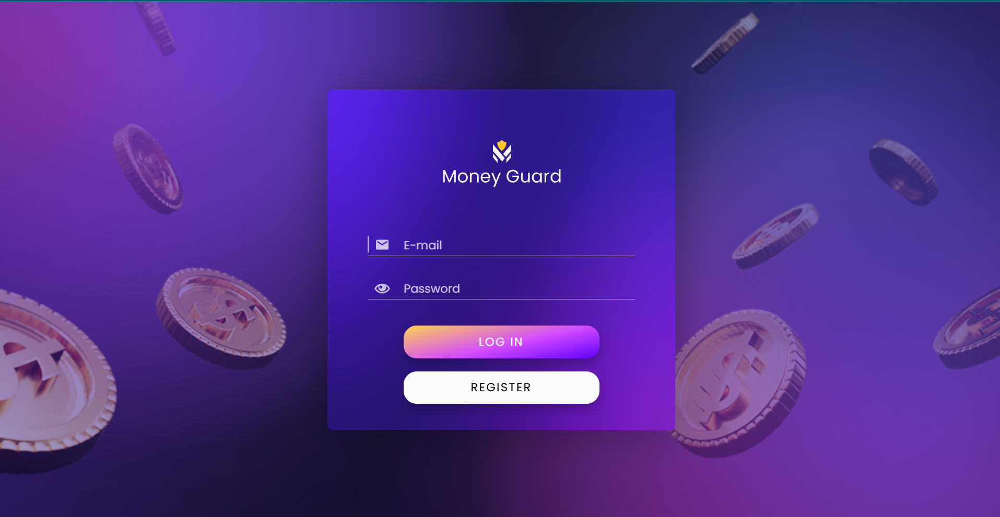
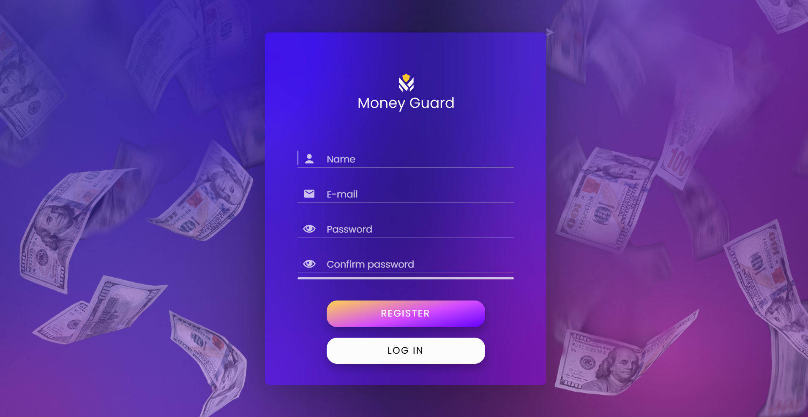
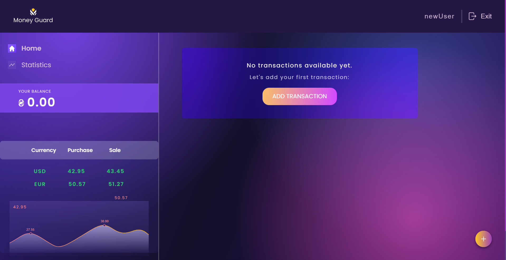
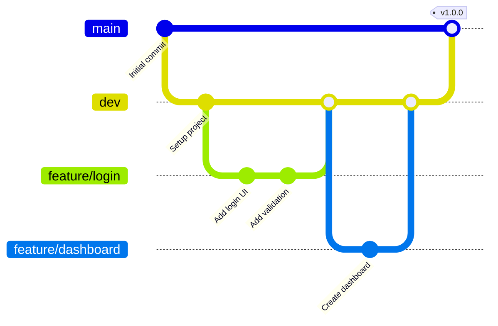

<div align="center">

# 💰 Money Guard

### Modern Kişisel Finans Yönetim Platformu

[](https://react.dev/)
[](https://redux-toolkit.js.org/)
[](https://vitejs.dev/)
[](LICENSE)

</div>

---

## 📖 Proje Hakkında

Money Guard, kullanıcıların gelir ve giderlerini takip edebilmelerini, finansal durumlarını analiz edebilmelerini ve bütçe yönetimini kolaylaştırmayı amaçlayan modern bir web uygulamasıdır. Karmaşık tablolardan kurtulup görsel ve interaktif bir deneyim sunarak finansal farkındalık yaratır.

> 💡 **Temel Amaç:** Kullanıcıların _"Param nereye gidiyor?"_ sorusuna anında ve net cevaplar bulmasını sağlamak.

### 🎯 Neden Money Guard?

- ✅ **Kolay Kullanım** - Sezgisel arayüz ile dakikalar içinde başlayın
- ✅ **Görsel Raporlar** - Harcamalarınızı anlık grafiklerle takip edin
- ✅ **Çoklu Kategori** - Harcamalarınızı detaylı kategorize edin
- ✅ **Güncel Kurlar** - Anlık döviz kuru bilgileri
- ✅ **Mobil Uyumlu** - Her cihazdan erişim

---

## ✨ Özellikler

<table>
<tr>
<td width="50%">

### 🔐 Güvenlik

- JWT tabanlı kimlik doğrulama
- Şifreli veri saklama
- Güvenli API iletişimi
- Otomatik oturum yönetimi

</td>
<td width="50%">

### 💳 İşlem Yönetimi

- Hızlı gelir/gider ekleme
- Kategori bazlı filtreleme
- İşlem düzenleme ve silme
- Detaylı işlem geçmişi

</td>
</tr>
<tr>
<td width="50%">

### 📊 Analiz & Raporlama

- İnteraktif grafikler
- Kategori bazlı istatistikler
- Aylık/yıllık karşılaştırmalar
- Trend analizleri

</td>
<td width="50%">

### 💱 Döviz Kurları

- Anlık kur bilgileri
- Çoklu döviz desteği
- Otomatik güncelleme
- Kur geçmişi takibi

</td>
</tr>
</table>

---

## 🖼️ Ekran Görüntüleri

<details open>
<summary><b>📱 Kullanıcı Arayüzü</b></summary>

<br>

### Giriş & Kayıt Ekranları

<p align="center">
  
  
</p>

### Ana Dashboard

<p align="center">
  
</p>

### İstatistikler & Grafikler

<p align="center">
  
</p>

</details>

---

## 🛠️ Teknoloji Yığını

<div align="center">

| Kategori             | Teknolojiler                                                                                                                                                                                                                                                                                 |
| -------------------- | -------------------------------------------------------------------------------------------------------------------------------------------------------------------------------------------------------------------------------------------------------------------------------------------- |
| **Frontend**         |    |
| **State Management** |  Redux Persist                                                                                                                                                                             |
| **Styling**          |  CSS Modules Modern Normalize                                                                                                                                                                         |
| **HTTP Client**      |                                                                                                                                                                                                    |
| **Form Management**  | Formik Yup React Hook Form                                                                                                                                                                                                                                                                   |
| **Charts**           | Chart.js Recharts                                                                                                                                                                                                                                                                            |
| **UI Components**    | React Icons React Toastify                                                                                                                                                                                                                                                                   |

</div>

---

## 🚀 Kurulum ve Çalıştırma

### Ön Gereksinimler

```bash
Node.js >= 16.x
npm >= 8.x veya yarn >= 1.22.x
```

### Hızlı Başlangıç

```bash
# 1. Projeyi klonlayın
git clone https://github.com/Money-Guard-Team/money-guard.git
cd money-guard

# 2. Bağımlılıkları yükleyin
npm install

# 3. Ortam değişkenlerini ayarlayın
cp .env.example .env

# 4. Geliştirme sunucusunu başlatın
npm run dev
```

Uygulama `http://localhost:5173` adresinde çalışacaktır.

### Diğer Komutlar

```bash
# Production build
npm run build

# Preview production build
npm run preview

# Linting
npm run lint

# Tests
npm run test
```

---

## 📂 Proje Yapısı

```
money-guard/
├── 📁 public/                  # Statik dosyalar
├── 📁 src/
│   ├── 📁 api/                 # API servisleri ve konfigürasyonları
│   │   ├── axiosConfig.js
│   │   └── endpoints.js
│   ├── 📁 assets/              # Görseller, fontlar, iconlar
│   │   ├── images/
│   │   └── styles/
│   ├── 📁 components/          # Tekrar kullanılabilir bileşenler
│   │   ├── Button/
│   │   ├── Modal/
│   │   ├── Chart/
│   │   └── ...
│   ├── 📁 pages/               # Sayfa bileşenleri
│   │   ├── Dashboard/
│   │   ├── Login/
│   │   ├── Register/
│   │   └── Statistics/
│   ├── 📁 redux/               # State yönetimi
│   │   ├── auth/
│   │   │   ├── authSlice.js
│   │   │   └── authThunks.js
│   │   ├── transactions/
│   │   │   ├── transactionsSlice.js
│   │   │   └── transactionsThunks.js
│   │   └── store.js
│   ├── 📁 routes/              # Route tanımları
│   │   ├── PrivateRoute.jsx
│   │   └── PublicRoute.jsx
│   ├── 📁 utils/               # Yardımcı fonksiyonlar
│   │   ├── formatters.js
│   │   └── validators.js
│   ├── App.jsx
│   └── main.jsx
├── 📄 .env.example             # Örnek environment dosyası
├── 📄 package.json
├── 📄 vite.config.js
└── 📄 README.md
```

---

## 🤝 Ekip & Roller

Bu proje, **Agile/Scrum** metodolojisi ile çalışan bir ekip tarafından geliştirilmiştir.

| Rol                       | Sorumluluklar                                                   |
| ------------------------- | --------------------------------------------------------------- |
| **🎨 Frontend Developer** | UI/UX implementasyonu, component geliştirme, responsive tasarım |
| **⚙️ Backend Developer**  | API geliştirme, veritabanı tasarımı, güvenlik                   |
| **🔄 DevOps Engineer**    | CI/CD pipeline, deployment, monitoring                          |
| **🧪 QA Engineer**        | Test senaryoları, bug tracking, kullanıcı testleri              |
| **📋 Scrum Master**       | Sprint planlama, stand-up yönetimi, engel kaldırma              |

### Git Workflow



**Branch Stratejisi:**

- `main` → Production-ready kod
- `dev` → Geliştirme dalı (tüm feature'lar burada birleşir)
- `feature/*` → Yeni özellikler
- `fix/*` → Bug düzeltmeleri
- `hotfix/*` → Acil production düzeltmeleri

---

## 📡 API Dokümantasyonu

**Base URL:** `https://wallet.b.goit.study/docs/`

### Kimlik Doğrulama

```http
POST /auth/sign-up
Content-Type: application/json

{
  "username": "johndoe",
  "email": "john@example.com",
  "password": "SecurePass123!"
}
```

```http
POST /auth/sign-in
Content-Type: application/json

{
  "email": "john@example.com",
  "password": "SecurePass123!"
}
```

### İşlemler

```http
GET /transactions
Authorization: Bearer {token}

# Response
{
  "transactions": [...],
  "total": 50,
  "page": 1
}
```

```http
POST /transactions
Authorization: Bearer {token}
Content-Type: application/json

{
  "type": "expense",
  "category": "food",
  "amount": 25.50,
  "date": "2024-02-05",
  "comment": "Market alışverişi"
}
```

---

## 🎨 UI/UX Tasarım Sistemi

### Renk Paleti

```css
/* Ana Renkler */
--primary: #4a56e2;
--secondary: #6e78ff;
--success: #24cca7;
--warning: #ffd700;
--danger: #ff6596;

/* Nötr Renkler */
--dark: #0c0d0d;
--gray: #757575;
--light-gray: #e7e5f2;
--white: #ffffff;
```

### Tipografi

- **Heading:** Poppins, sans-serif
- **Body:** Circe, sans-serif
- **Monospace:** Fira Code

---

## 🧪 Test

```bash
# Unit testleri çalıştır
npm run test

# Coverage raporu
npm run test:coverage

# E2E testler
npm run test:e2e
```

---

## 📈 Performans

- ⚡ Lighthouse Score: 95+
- 🚀 First Contentful Paint: < 1.5s
- 📦 Bundle Size: < 200KB (gzipped)
- ♿ Accessibility: WCAG 2.1 AA

---

### Adımlar

1. 🍴 Projeyi fork edin
2. 🌿 Feature branch oluşturun (`git checkout -b feature/amazing-feature`)
3. 💾 Değişikliklerinizi commit edin (`git commit -m 'feat: Add amazing feature'`)
4. 📤 Branch'inizi push edin (`git push origin feature/amazing-feature`)
5. 🎉 Pull Request açın

### Commit Kuralları

Conventional Commits standardını kullanıyoruz:

```
feat: Yeni özellik
fix: Bug düzeltmesi
docs: Dokümantasyon değişikliği
style: Kod formatı değişikliği
refactor: Kod iyileştirmesi
test: Test ekleme/düzeltme
chore: Build veya yardımcı araç değişiklikleri
```

---

## 📞 İletişim & Destek

<div align="center">

### Bizimle İletişime Geçin

[](https://github.com/Money-Guard-Team)
[](mailto:support@moneyguard.com)
[](https://discord.gg/moneyguard)

</div>

---

<div align="center">

**[⬆ Başa Dön](#-money-guard)**

</div>
